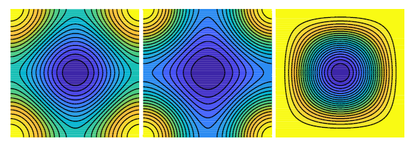

# Quarter Laplacian Filter

This repository implements Quarter Laplacian Filter for Edge Aware Image Processing using the approach mentioned in this
[paper](https://github.com/bonaventuredossou/dvip_project/blob/main/data/ICIP%201%20-%20QUARTER%20LAPLACIAN%20FILTER%20FOR%20EDGE%20AWARE%20IMAGE%20PROCESSING.pdf).

## Overview
Image smoothing is the fundamental operation in image processing. We use it to remove image details or noise in the
image. Its applications include depth estimation, optical flow estimation, stereo vision, surface reconstruction, 
object detection, etc. While performing smoothing operation, it is important to remove small gradients (texture) and 
preserve the large ones (structure), also called edge preserving.

### Limitations of deep learning based filtering
The edge preserving property can be achieved by CNNs. However, CNNs:
- Can not be adapted to high-resolution images
- Need high computational resources limiting their applicability in real-time applications
- Lead to unwanted artifacts and their weights are uninterpretable

### Quarter window filters (QWF)
The novel approach presented in the paper, is to use only quarter part of the classical filters i.e. Laplace filter,
Gaussian filter, Bilateral filter etc. The paper and this repository focuses on Quarter Laplacian Filter (QLF).

Discrete Laplacian operator originally obtained from discrete diffusion equation:

```math
U^{t+1}(x_i, y_j) = U^t(x_i, y_j) + c \Delta U^t(x_i, y_j)
```

and standard discrete Laplacian Kernels are as follows:

<pre>
[0,   1/4, 0  ]   [-1/16, 5/16, -1/16]   [1/12, 1/6, 1/12]
[1/4, -1,  1/4] , [5/16,  -1,    5/16] , [1/6,  -1,   1/6]
[0,   1/4, 0  ]   [-1/16, 5/16, -1/16]   [1/12, 1/6, 1/12]
</pre>

<br/>
Fig1: Spectral analysis of discrete Laplacian operators<br/><br/>

The right kernel is the most isotropic one and is chosen for implementation in this repository. The paper proposes to 
use quarter window of discrete Laplacian operator.  Therefore, the quarter Laplacian filters would be as follows:

<pre>
     [1/3, 1/3, 0]        [0, 1/3, 1/3]        [0,   0,   0]        [0,     0, 0]
K1 = [1/3, -1,  0] , K2 = [0,  -1, 1/3]   K3 = [0,  -1, 1/3] , K4 = [1/3,  -1, 0]
     [0,   0,   0]        [0,   0,   0]        [0, 1/3, 1/3]        [1/3, 1/3, 0]
</pre>

<br/>
Fig2: four quarter windows for the center location (red dot)<br/><br/>

We would obtain four feature maps from these kernels. 

```math
d_i = k_i * U, \forall i = 1,...,4
```

where * is convolution operator. Then only one feature map $d_{m(x,y)}(x, y)$ is selected, where

```math
m(x,y) = argmin_i\{|d_i(x,y)|; i = 1,...,4\}
```

This $d_{m(x,y)}(x, y)$ is the result of the quarter Laplacian filtering as explained in the paper.

#### Advantages of QWF
Using QWFs have significant advantages over classical full window filters such as:
- QWFs can preserve edges better allowing discontinuity in results producing sharp edges compared to their full 
window versions.
- QWFs have smaller support region (2X2 in this case) compared to standard filters (3X3 or higher). Smaller
support region indicates more local geometric information.
- QWFs can be implemented using box filter, leading to high performance.

## Implementation
The filter can be implemented using 2X2 box filter as follows:

<pre>
     [1/3, 1/3, 0]           [1, 1, 0]       [0,  0,  0]
K1 = [1/3, -1,  0]   =   1/3 [1, 1, 0] - 4/3 [0,  1,  0]
     [0,   0,   0]           [0, 0, 0]       [0,  0,  0]
</pre>

A 2×2 box filter (without normalization) is used to compute the sum over each 2×2 region. Then for each pixel $(i, j)$, 
where full 2X2 block exists, it computes

```math
response(i,j) = \frac{1}{3} . box\_sum(i, j) - \frac{4}{3} . U(i+1, j+1)
```

### faster implementation leveraging overlapped support region
The QLF requires four directional responses (from four quarter windows $k_i , \forall i = 1,...,4$). Therefore,
- Instead of convolving four separate kernels, the input image is rotated in 0°, 90°, 180°, and 270° increment.
- Apply the fast $K_1$ response, then rotate each result back. This technique exploits the overlapping support so that 
the same box filter computation can be reused after simple rotations.
- All four directional responses are stacked. For each pixel, the response with the smallest absolute value is selected 
(mimicking the non–linear min–selection step in QLF).
- The selected response is then either added to the image (diffusion) or used as the direct output, 
depending on the `add_to_input` flag for the filter.

Because of the overlapping support region and reusability via rotation, we perform only one box filtering per rotated 
version instead of four independent convolutions. This achieves nearly the same runtime as a conventional Laplacian 
filter.

## Experimentation

Conducted experiments for quantitative evaluation and Low light enhancement use case demonstration.

### Quantitative Evaluation
The quantitative evaluation is performed using following metrics:

#### 1. PSNR (Peak Signal-to-Noise Ratio)
How much the filtered image deviates from the original. It assumes the original is the “ground truth” and higher values 
mean the processed image is closer (less distorted).

```math
PSNR = 10 . log_{10}(\frac{MAX^2}{MSE})
```

Where, $MAX$ is the maximum possible pixel value (e.g., 255) and $MSE$ is the Mean Squared Error between the original 
and processed images

High PSNR means good preservation of image details and low PSNR means high distortion introduced by filtering.

#### 2. SSIM (Structural Similarity Index)
How structurally similar two images are beyond just pixel-wise error. It considers Luminance, Contrast, Structure

Range:
```math
SSIM \in [0, 1]
```

When, $SSIM$ is $1$ means perfectly similar and $\lt1$ concludes some structural differences

#### 3. EPI (Edge Preservation Index)
It measures how well the edges in the image are preserved after filtering. It compares the edge maps 
(e.g., from Sobel or Canny) of the original vs. filtered images.

For implementation, applied edge detection (Canny) to both original and filtered images. Then, Compared the edge 
strength or patterns using Dice coefficient between binary edge maps.

Higher EPI means the filtering preserved more of the original edges.

#### Summary of metrics used for quantitative analysis
| Metric | Measures               | Range      | Good Value | Notes                                     |
|--------|------------------------|------------|------------|-------------------------------------------|
| PSNR   | Pixel-wise fidelity    | 0 - inf dB | > 30 dB    | Doesn’t reflect perceptual quality well   |
| SSIM   | Structural similarity  | 0 - 1      | > 0.9      | Closer to 1 is better                     |
| EPI    | Edge preservation      | 0 - 1      | > 0.7      | Custom metric; reflects paper's goal well |

### Low Light Enhancement Use Case Demonstration
test

## Results
test

## How to Run
```
python main.py
```


