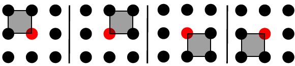

# Quarter Laplacian Filter

This repository implements Quarter Laplacian Filter for Edge Aware Image Processing using the approach mentioned in this
[paper](https://github.com/bonaventuredossou/dvip_project/blob/main/data/ICIP%201%20-%20QUARTER%20LAPLACIAN%20FILTER%20FOR%20EDGE%20AWARE%20IMAGE%20PROCESSING.pdf).

## Overview
Image smoothing is the fundamental operation in image processing. We use it to remove image details or noise in the
image. Its applications include depth estimation, optical flow estimation, stereo vision, surface reconstruction, 
object detection, etc. While performing smoothing operation, it is important to remove small gradients (texture) and 
preserve the large ones (structure), also called edge preserving.

### Limitations of deep learning based filtering
The edge preserving property can be achieved by CNNs. However, CNNs:
- Can not be adapted to high-resolution images
- Need high computational resources limiting their applicability in real-time applications
- Lead to unwanted artifacts and their weights are uninterpretable

### Quarter window filters
The novel approach presented in the paper, is to use only quarter part of the classical filters i.e. Laplace filter,
Gaussian filter, Bilateral filter etc.

Discrete Laplacian operator originally obtained from discrete diffusion equation:

```math
U^{t+1}(x_i, y_j) = U^t(x_i, y_j) + c \Delta U^t(x_i, y_j)
```

and standard discrete Laplacian Kernels are as follows:

<pre>
[0,   1/4, 0  ]   [-1/16, 5/16, -1/16]   [1/12, 1/6, 1/12]
[1/4, -1,  1/4] , [5/16,  -1,    5/16] , [1/6,  -1,   1/6]
[0,   1/4, 0  ]   [-1/16, 5/16, -1/16]   [1/12, 1/6, 1/12]
</pre>

<br/><br/>
Fig1: Spectral analysis of discrete Laplacian operators

The right kernel is the most isotropic one and is chosen for implementation in this repository. The paper proposes to 
use quarter window of discrete Laplacian operator.  Therefore, the quarter Laplacian filters would be as follows:

<pre>
     [1/3, 1/3, 0]        [0, 1/3, 1/3]        [0,   0,   0]        [0,     0, 0]
K1 = [1/3, -1,  0] , K2 = [0,  -1, 1/3]   K3 = [0,  -1, 1/3] , K4 = [1/3,  -1, 0]
     [0,   0,   0]        [0,   0,   0]        [0, 1/3, 1/3]        [1/3, 1/3, 0]
</pre>

<br/><br/>
Fig2: four quarter windows for the center location (red dot)

We would obtain four feature maps from these kernels. 

```math
d_i = k_i * U, \forall i = 1,...,4
```

where * is convolution operator. Then only one feature map $d_{m(x,y)}(x, y)$ is selected, where

```math
m(x,y) = argmin_i\{|d_i(x,y)|; i = 1,...,4\}
```

This $d_{m(x,y)}(x, y)$ is the result of the quarter Laplacian filtering as explained in the paper.

### Advantages of quarter window filters
Using quarter window filters (QWF) have significant advantages over classical full window filters such as:
- QWFs can preserve edges better allowing discontinuity in results producing sharp edges compared to their full 
window versions.
- QWFs have smaller support region (2X2 in this case) compared to standard filters (3X3 or higher). Smaller
support region indicates more local geometric information.
- QWFs can be implemented using box filter, leading to high performance.

## Implementation
test

## Installation

NOTE: Linux based OS or MacOS required to run this shell script.

1.	Clone the repository from git.
2.	Open the command line interface (CLI) of your OS and move to the project folder <i>ICIP1_quarter_laplacian/</i> 
      using cd command.
3.	Run the installation script using following command
	
	$ ./install.sh
          
this script will automatically create a new directory namely <i>env_dir/</i> to create a virtual environment, activate 
that environment and install all the required library into that.

NOTE: If you get permission denied error while running this script, kindly run the command
	
    $ chmod 755 install.sh

4.  Once the project is installed and environment is activated, <i>main.py</i> can be run using Python3 as follows 


    $ python3 main.py [image_name]

It is important to note that we are using Python3 for the implementation purpose. Also, user can provide image name with
its path as an optional parameter to <i>main.py</i> which will be considered as base original image and all operations 
will be performed on that image. If parameter is not provided, all smoothing operations will be performed on this 
[standard camera-man image](https://scikit-image.org/docs/stable/api/skimage.data.html#skimage.data.camera) which is 
similar to the one shown in paper of ICIP1.
