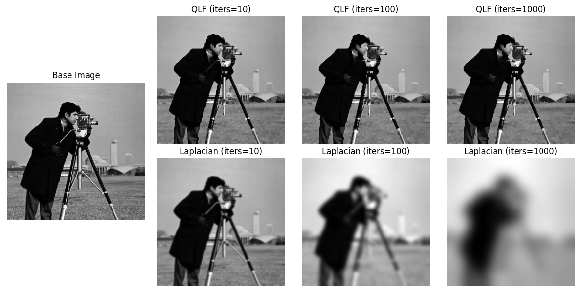
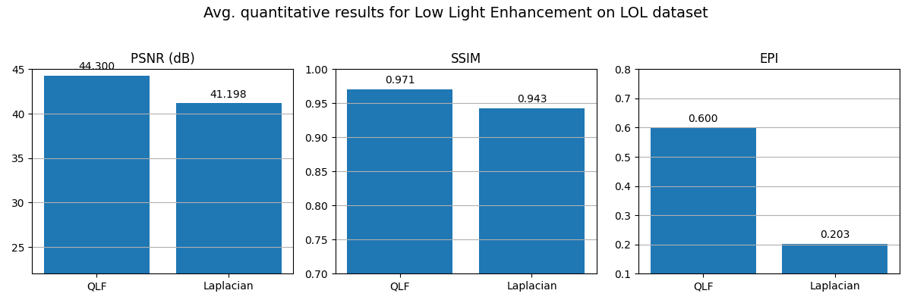
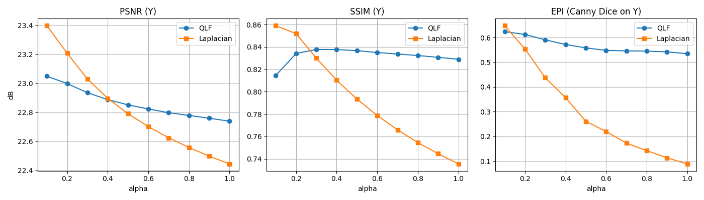

# Quarter Laplacian Filter

This repository implements Quarter Laplacian Filter (QLF) for Edge Aware Image Processing using the algorithm mentioned 
in this
[paper](https://github.com/ChiragVaghela10/quarter_laplacian/blob/refactoring/data/ICIP%201%20-%20QUARTER%20LAPLACIAN%20FILTER%20FOR%20EDGE%20AWARE%20IMAGE%20PROCESSING.pdf).

Experiments were also carried on enhancing low-light images of LOL dataset using QLF and compared against isotropic 
Laplacian filter. The quantitative analysis is performed using PSNR, SSIM, and EPI as evaluation metrics.

<br/>
Fig1: Results of Quarter Laplacian Filter compared to standard Laplacian Filter applied for multiple iterations<br/>

## Overview
Image smoothing is the fundamental operation in image processing. We use it to remove image details or noise in the
image. Its applications include depth estimation, optical flow estimation, stereo vision, surface reconstruction, 
object detection, etc. While performing smoothing operation, it is important to remove small gradients (texture) and 
preserve the large ones (structure), also called edge preserving.

### Limitations of deep learning based filtering
The edge preserving property can be achieved by CNNs. However, CNNs:
- Can not be adapted to high-resolution images
- Need high computational resources limiting their applicability in real-time applications
- Lead to unwanted artifacts and their weights are uninterpretable

### Quarter window filters (QWF)
The novel approach presented in the paper, is to use only quarter part of the classical filters i.e. Laplace filter,
Gaussian filter, Bilateral filter etc. The paper and this repository focuses on Quarter Laplacian Filter (QLF).

Discrete Laplacian operator originally obtained from discrete diffusion equation:

```math
U^{t+1}(x_i, y_j) = U^t(x_i, y_j) + c \Delta U^t(x_i, y_j)
```

and standard discrete Laplacian Kernels are as follows:

<pre>
[0,   1/4, 0  ]   [-1/16, 5/16, -1/16]   [1/12, 1/6, 1/12]
[1/4, -1,  1/4] , [5/16,  -1,    5/16] , [1/6,  -1,   1/6]
[0,   1/4, 0  ]   [-1/16, 5/16, -1/16]   [1/12, 1/6, 1/12]
</pre>

<br/>
Fig2: spectral analysis of discrete Laplacian operators<br/><br/>

The right kernel is the most isotropic one and is chosen for implementation in this repository. The paper proposes to 
use quarter window of discrete Laplacian operator.  Therefore, the kernels of quarter Laplacian filter 
would be as follows:

<pre>
     [1/3, 1/3, 0]        [0, 1/3, 1/3]        [0,   0,   0]        [0,     0, 0]
K1 = [1/3, -1,  0] , K2 = [0,  -1, 1/3]   K3 = [0,  -1, 1/3] , K4 = [1/3,  -1, 0]
     [0,   0,   0]        [0,   0,   0]        [0, 1/3, 1/3]        [1/3, 1/3, 0]
</pre>

<br/>
Fig3: four quarter windows for the center location (red dot)<br/><br/>

We would obtain four feature maps from these kernels. 

```math
d_i = k_i * U, \forall i = 1,...,4
```

where * is convolution operator. Then only one feature map $d_{m(x,y)}(x, y)$ is selected, where

```math
m(x,y) = argmin_i\{|d_i(x,y)|; i = 1,...,4\}
```

This $d_{m(x,y)}(x, y)$ is the result of the quarter Laplacian filtering as explained in the paper.

#### Advantages of QWF
Using QWFs have significant advantages over classical full window filters such as:
- QWFs can preserve edges better allowing discontinuity in results producing sharp edges compared to their full 
window versions.
- QWFs have smaller support region (2X2 in this case) compared to standard filters (3X3 or higher). Smaller
support region indicates more local geometric information.
- QWFs can be implemented using box filter, leading to high performance.

## Implementation
The filter can be implemented using 2X2 box filter as follows:

<pre>
     [1/3, 1/3, 0]           [1, 1, 0]       [0,  0,  0]
K1 = [1/3, -1,  0]   =   1/3 [1, 1, 0] - 4/3 [0,  1,  0]
     [0,   0,   0]           [0, 0, 0]       [0,  0,  0]
</pre>

A 2×2 box filter (without normalization) is used to compute the sum over each 2×2 region. Then for each pixel $(i, j)$, 
where full 2X2 block exists, it computes

```math
response(i,j) = \frac{1}{3} . box\_sum(i, j) - \frac{4}{3} . U(i+1, j+1)
```

### faster implementation leveraging overlapped support region

Because of the overlapping support region, we perform only one box filtering instead of four independent convolutions. 
This achieves nearly the same runtime as a conventional Laplacian filter.

The QLF requires four directional responses (from four quarter windows $k_i , \forall i = 1,...,4$). It is achieved by,
- Instead of convolving four separate kernels, only one convolution is performed using box-filter.
- Then, overlapped support region is leveraged as shown in fig 4. The bottom right region of kernel 1 is same as top-left
region of kernel 3.

<br/>
Fig4: overlapped support regions for different locations can be used to reduce the computation. e.g. the bottom-right
region for the red dot is exactly the upper left region for the yellow dot.<br/><br/>

- All four directional responses are extracted out from convolution result. Then, for each pixel, the response with 
the smallest absolute value is selected (mimicking the non–linear min–selection step in QLF).
- The selected response is then added to the image (diffusion process).

## Experimentation

Conducted experiments for quantitative evaluation and Low light enhancement use case demonstration.

### Quantitative Evaluation
The quantitative evaluation is performed using following metrics:

#### 1. PSNR (Peak Signal-to-Noise Ratio)
How much the filtered image deviates from the original. It assumes the original is the “ground truth” and higher values 
mean the processed image is closer (less distorted).

```math
PSNR = 10 . log_{10}(\frac{MAX^2}{MSE})
```

Where, $MAX$ is the maximum possible pixel value (e.g., 255) and $MSE$ is the Mean Squared Error between the original 
and processed images

High PSNR means good preservation of image details and low PSNR means high distortion introduced by filtering.

#### 2. SSIM (Structural Similarity Index)
How structurally similar two images are beyond just pixel-wise error. It considers Luminance, Contrast, Structure

Range:
```math
SSIM \in [0, 1]
```

When, $SSIM$ is $1$ means perfectly similar and $\lt1$ concludes some structural differences

#### 3. EPI (Edge Preservation Index)
It measures how well the edges in the image are preserved after filtering. It compares the edge maps 
(e.g., from Sobel or Canny) of the original vs. filtered images.

For implementation, applied edge detection (Canny) to both original and filtered images. Then, Compared the edge 
strength or patterns using Dice coefficient between binary edge maps.

Higher EPI means the filtering preserved more of the original edges.

#### Summary of metrics used for quantitative analysis
| Metric | Measures             | Range      | Good Value | Notes                                     |
|--------|----------------------|------------|------------|-------------------------------------------|
| PSNR   | Pixel-wise fidelity  | 0 - inf dB | > 30 dB    | Doesn’t reflect perceptual quality well   |
| SSIM   | Structural similarity| 0 - 1      | > 0.9      | Closer to 1 is better                     |
| EPI    | Edge preservation    | 0 - 1      | > 0.7      | Custom metric; reflects paper's goal well |

### Low Light Enhancement Use Case Demonstration
The pipeline implemented for enhancement of low-light image in following steps:

1. For each image, convert low-light image to YCrCb color space
2. Approximate gain using luminance (Y) of low-light and corresponding base image
3. Restore low-light image using approximated gain
4. Apply QLF or Laplace filter
5. Evaluate metrics

The Quarter Laplacian Filter (QLF) was applied to 500 low-light images of the
[LOL dataset](https://www.kaggle.com/datasets/soumikrakshit/lol-dataset). For each image, three quantitative metrics
PSNR, SSIM, and EPI were computed after applying both the QLF and the standard Laplacian filter independently. 
Finally, the average values of all three metrics were calculated across the entire dataset to provide a 
comprehensive comparison of the two filtering approaches.

The robustness of QLF is also compared against standard Laplacian Filter for various values of alpha ($c$) in the 
diffusion process ranging (0.1, 0.2, ..., 1.0).

## Results

Performance comparison of QLF vs Laplace filter using PSNR, SSIM, and EPI on 500 low-light images:

<br/><br/>

QLF consistently outperforms the standard Laplacian filter across all three metrics:
- A higher PSNR generally indicates better image quality (less distortion). QLF achieves a +3.1 dB improvement over 
the Laplacian filter, indicating that it produces less noisy or distorted outputs and preserves the original image 
fidelity better.
- SSIM measures perceptual similarity, focusing on luminance, contrast, and structure. The QLF outperforms the Laplacian 
filter implying QLF preserves structures and textures significantly better, which is especially critical in low-light 
images where structural features can easily be lost.
- EPI measures how well edges are preserved in the filtered image. QLF again shows better performance with a +0.4 gain, 
meaning it retains edge details more effectively than the standard Laplacian, which is crucial for maintaining the 
sharpness and clarity of objects.

The following results are obtained for $c$ = [0.1, 0.2, ..., 1.0] in discrete diffusion equation mentioned above, and
iterations = 10 for both filters:
<br/><br/>

It shows that laplacian filter becomes very unstable when aggressive filtering is applied on very dark images.

## How to Run
```
python main.py
```

## Citation
Gong, Yuanhao & Tang, Wenming & Zhou, Lebin & Yu, Lantao & Qiu, Guoping. (2021). Quarter Laplacian Filter For Edge 
Aware Image Processing. 1959-1963. 10.1109/ICIP42928.2021.9506503. 

## Future Prospects
- Optimize execution time introducing GPU utilization 
- Explore more quantitative matrics
- Conduct more experiments using more parameters

